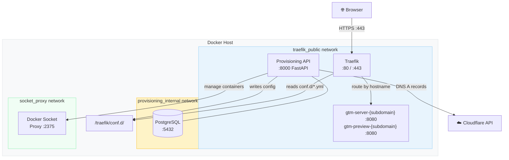

# Server-Side GTM Tracking Platform

A self-hosted, multi-tenant platform for running Google Tag Manager server-side containers behind a first-party domain. Each client gets a dedicated GTM container provisioned automatically — with DNS, TLS, and routing configured through a single API call.

Proxying analytics through your own domain bypasses most ad blockers and gives you complete control over the data pipeline.

---

## Table of Contents

- [How It Works](#how-it-works)
- [Architecture](#architecture)
- [Services](#services)
- [Prerequisites](#prerequisites)
- [Quick Start (Local Dev)](#quick-start-local-dev)
- [Production Setup](#production-setup)
- [Environment Variables](#environment-variables)
- [Provisioning API](#provisioning-api)
- [Client Lifecycle](#client-lifecycle)
- [Addons](#addons)
- [Custom Domains](#custom-domains)
- [Security](#security)
- [Project Structure](#project-structure)

---

## How It Works

When a client is provisioned:

1. A Cloudflare DNS **A record** is created: `{subdomain}.{BASE_DOMAIN}` → your VM IP
2. A **Traefik dynamic config** file is written with routing rules and middleware for that subdomain
3. Two **Docker containers** are started: a GTM server container and a GTM preview container
4. The platform **monitors Docker health events** — when the container reports healthy, the client status transitions to `active`

Browser analytics requests hit `{subdomain}.{BASE_DOMAIN}`, Traefik routes them to the GTM container, which processes tags and forwards events to Google Analytics.

```
Browser
  │
  │  https://{subdomain}.{BASE_DOMAIN}/g/collect
  ▼
Traefik  ──── TLS termination, rate limiting, per-client routing
  │
  ▼
gtm-server-{subdomain}  ──── Google Cloud Tagging container
  │
  │  enriched event
  ▼
Google Analytics / other destinations
```

---

## Architecture



**Network isolation:**

| Network | Purpose | External |
|---|---|---|
| `traefik_public` | Traefik ↔ GTM containers ↔ Provisioning API | Yes (80/443) |
| `gtm_internal` | GTM server ↔ preview container (isolated) | No |
| `socket_proxy` | Provisioning API ↔ Docker socket proxy | No |
| `provisioning_internal` | Provisioning API ↔ PostgreSQL | No |

---

## Services

### Traefik
Handles all inbound HTTPS traffic. Routes requests to the correct GTM container based on hostname. Automatically provisions TLS certificates via Cloudflare DNS challenge (Let's Encrypt). Reads per-client routing configs from `/traefik/conf.d/` — the provisioning API writes these files when clients are created.

### Provisioning API
FastAPI service that manages the full client lifecycle: DNS → Traefik config → Docker containers. Exposes a REST API protected by API keys. Maintains state in PostgreSQL. Listens to Docker container events to track container health in real time.

See [`services/provisioning-api/README.md`](services/provisioning-api/README.md) for full API documentation.

### PostgreSQL
Stores all provisioning state: client records, API keys, custom domain status. Only accessible on the internal `provisioning_internal` network.

### Docker Socket Proxy
A locked-down proxy for the Docker Unix socket. The provisioning API connects through this instead of mounting the socket directly, limiting what operations are permitted.

---

## Prerequisites

- Docker Engine 24+ with Docker Compose v2
- A domain with DNS managed on Cloudflare
- A Cloudflare API token with **Zone:DNS:Edit** permissions for your zone
- A public IP (VM, VPS, etc.) for production use

---

## Quick Start (Local Dev)

Local dev uses `localtest.me` (all subdomains resolve to `127.0.0.1`) — no real DNS needed.

### 1. Clone with submodules

```bash
git clone --recurse-submodules https://github.com/your-org/server-side-tracking.git
cd server-side-tracking
```

### 2. Create secrets file

```bash
mkdir -p secrets
echo "your-cloudflare-token" > secrets/cloudflare_token.txt
```

For local dev with `MOCK_CLOUDFLARE=true` this file still needs to exist (can be a placeholder):

```bash
echo "placeholder" > secrets/cloudflare_token.txt
```

### 3. Configure environment

```bash
cp .env.example .env
```

Edit `.env`:

```env
BASE_DOMAIN=localtest.me
MOCK_CLOUDFLARE=true
TRAEFIK_RESTART_ON_CONFIG_CHANGE=true
PREVIEW_USE_SIDECAR=true
ACME_EMAIL=you@example.com
```

The remaining fields (`CF_ZONE_ID`, `VM_IP`, `TRAEFIK_DASHBOARD_AUTH`) are only needed for production.

### 4. Start the stack

```bash
docker compose up -d
```

### 5. Create an API key

```bash
docker compose exec provisioning-api uv run python -c "
import bcrypt, uuid
raw = 'my-local-dev-key'
hashed = bcrypt.hashpw(raw.encode(), bcrypt.gensalt()).decode()
print('Key hash:', hashed)
print('Use header: X-API-Key:', raw)
"
```

Insert the hash into the database:

```bash
docker compose exec postgres psql -U provisioning -d provisioning -c \
  "INSERT INTO api_keys (id, name, key_hash) VALUES (gen_random_uuid(), 'dev-key', '<hash>');"
```

### 6. Provision a client

```bash
curl -X POST https://api.localtest.me/api/v1/clients \
  -H "X-API-Key: my-local-dev-key" \
  -H "Content-Type: application/json" \
  -d '{
    "name": "Acme Corp",
    "subdomain": "acme",
    "container_config": "<base64-encoded GTM container config>"
  }'
```

The GTM server will be available at `https://acme.localtest.me` once the container reports healthy (typically 30–60 seconds).

---

## Production Setup

### 1. VM / VPS requirements

- 2 vCPU, 4 GB RAM minimum (each GTM container uses ~512 MB)
- Ubuntu 22.04 or Debian 12 recommended
- Ports 80 and 443 open

### 2. DNS pre-configuration

Point a wildcard DNS record at your VM IP, or let the provisioning API create per-client A records automatically via Cloudflare.

### 3. Configure environment

```env
BASE_DOMAIN=yourdomain.com
ACME_EMAIL=admin@yourdomain.com
CF_ZONE_ID=your-cloudflare-zone-id
VM_IP=1.2.3.4
TRAEFIK_DASHBOARD_AUTH=user:$apr1$...   # htpasswd format
MOCK_CLOUDFLARE=false
TRAEFIK_RESTART_ON_CONFIG_CHANGE=false  # Linux inotify works, no restart needed
PREVIEW_USE_SIDECAR=false               # Traefik handles preview TLS in production
```

### 4. Cloudflare API token

The token needs **Zone:DNS:Edit** scope for your zone. Store it at `./secrets/cloudflare_token.txt` (this path is gitignored).

### 5. Deploy

```bash
docker compose up -d
```

Traefik will obtain TLS certificates automatically on first request.

---

## Environment Variables

| Variable | Default | Description |
|---|---|---|
| `BASE_DOMAIN` | — | Root domain. Clients are served at `{subdomain}.{BASE_DOMAIN}` |
| `ACME_EMAIL` | — | Email for Let's Encrypt registration |
| `CF_ZONE_ID` | — | Cloudflare zone ID for DNS record management |
| `VM_IP` | — | Public IP address for DNS A records |
| `TRAEFIK_DASHBOARD_AUTH` | — | Basic auth credentials for Traefik dashboard (htpasswd format) |
| `MOCK_CLOUDFLARE` | `false` | Skip real Cloudflare API calls (local dev) |
| `TRAEFIK_RESTART_ON_CONFIG_CHANGE` | `false` | Restart Traefik after config write (required on Windows/WSL2, not needed on Linux) |
| `PREVIEW_USE_SIDECAR` | `false` | Use nginx sidecar for preview server TLS (local dev only) |

---

## Provisioning API

Full documentation: [`services/provisioning-api/README.md`](services/provisioning-api/README.md)

**Base URL:** `https://api.{BASE_DOMAIN}`  
**Auth:** `X-API-Key: <key>` header on all requests

### Endpoints at a glance

| Method | Path | Description |
|---|---|---|
| `POST` | `/api/v1/clients` | Provision a new GTM client |
| `GET` | `/api/v1/clients` | List all active clients |
| `GET` | `/api/v1/clients/{id}` | Get client details |
| `PATCH` | `/api/v1/clients/{id}` | Update name, container config, or addons |
| `DELETE` | `/api/v1/clients/{id}` | Deprovision client (stops containers, removes DNS) |
| `POST` | `/api/v1/clients/{id}/suspend` | Stop containers, keep config |
| `POST` | `/api/v1/clients/{id}/resume` | Restart suspended containers |
| `GET` | `/api/v1/clients/{id}/health` | Live container health status |
| `GET` | `/api/v1/clients/{id}/snippet` | GTM tracking snippet for the client |
| `POST` | `/api/v1/clients/{id}/custom-domain` | Add a custom domain |
| `GET` | `/api/v1/clients/{id}/custom-domain/status` | Custom domain verification status |
| `DELETE` | `/api/v1/clients/{id}/custom-domain` | Remove custom domain |

---

## Client Lifecycle

```
                  POST /clients
                       │
                       ▼
                 provisioning ──── containers starting
                       │
                       │  Docker health_status: healthy event
                       ▼
                    active ──── serving traffic
                    │    │
         /suspend   │    │  container crash / OOM
                    ▼    ▼
                suspended  error ──── needs investigation
                    │
         /resume    │
                    ▼
                  active
                    │
          /delete   │
                    ▼
                  deleted ──── containers stopped, DNS removed
```

**Status values:**

| Status | Meaning |
|---|---|
| `provisioning` | Container started, waiting for health check to pass |
| `active` | Container healthy, serving traffic |
| `suspended` | Containers intentionally stopped, config preserved |
| `error` | Container died unexpectedly (crash, OOM) |
| `deleted` | Soft-deleted, containers and DNS cleaned up |

---

## Addons

Each client has a configurable set of addons:

| Addon | Default | Description |
|---|---|---|
| `geoip` | `false` | GeoIP lookup via Traefik plugin (requires GeoLite2 database) |
| `bot_filter` | `false` | Block common crawler user agents via Traefik plugin |
| `gtm_js_proxy` | `true` | Proxy GTM loader script through your domain |
| `lib_proxy` | `false` | Proxy third-party tag libraries |
| `cookie_extension` | `false` | Server-side cookie extension for longer expiry |
| `rate_limit_rps` | `50` | Per-client rate limit (requests per second) |

Update addons via `PATCH /api/v1/clients/{id}`:

```json
{
  "addons": {
    "geoip": true,
    "rate_limit_rps": 100
  }
}
```

Addon changes are additive — unspecified keys are preserved.

---

## Custom Domains

Clients can serve traffic from their own domain (e.g., `analytics.acme.com`) instead of the platform subdomain.

1. Add the domain: `POST /api/v1/clients/{id}/custom-domain` with `{"domain": "analytics.acme.com"}`
2. Add a CNAME record: `analytics.acme.com → acme.{BASE_DOMAIN}`
3. The platform polls DNS until the CNAME resolves correctly, then transitions the domain to `active`
4. Once active, the snippet endpoint returns the custom domain URL

---

## Security

- **API key auth** on all endpoints (bcrypt-hashed, stored in PostgreSQL)
- **Docker socket proxy** — the provisioning API never touches the raw Docker socket; only specific Docker API operations are permitted
- **Network isolation** — PostgreSQL is only reachable from the provisioning API; GTM containers are on a separate internal network
- **No shell injection** — container commands use the `CMD` exec form (no shell), avoiding shell injection vectors
- **Atomic config writes** — Traefik config files are written via `tempfile + os.replace()` to prevent partial writes from corrupting routing for other clients
- **Secrets** are mounted as Docker secrets, not passed as environment variables

---

## Project Structure

```
.
├── docker-compose.yml          # Main stack definition
├── .env.example                # Environment variable template
├── secrets/                    # Cloudflare API token (gitignored)
├── traefik/
│   ├── config/
│   │   └── traefik.yml         # Traefik static config
│   └── conf.d/                 # Dynamic configs (written at runtime)
└── services/
    └── provisioning-api/       # Git submodule — FastAPI provisioning service
```
